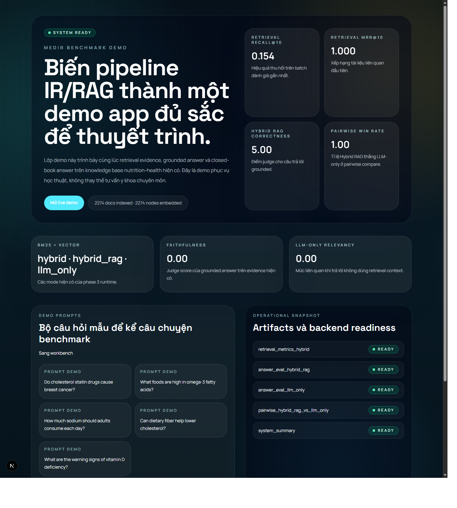
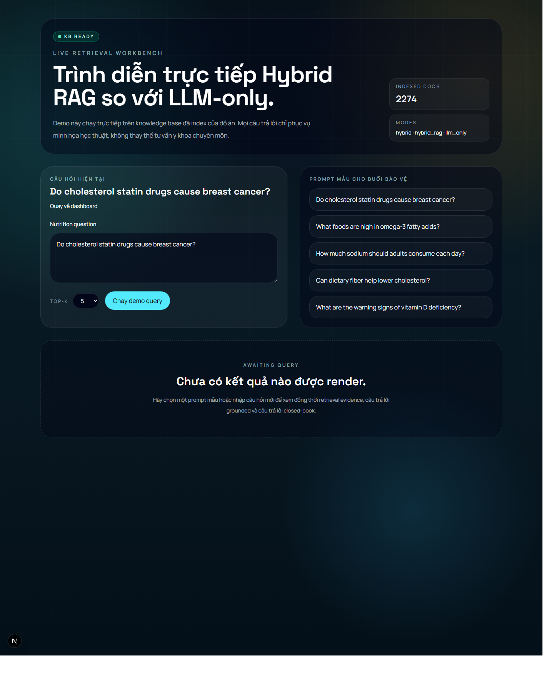
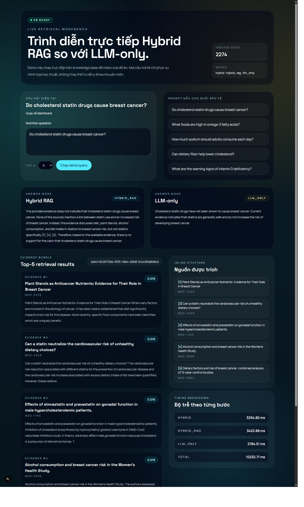

# BÁO CÁO KẾT THÚC HỌC PHẦN

## TRƯỜNG ĐẠI HỌC NGOẠI NGỮ - TIN HỌC THÀNH PHỐ HỒ CHÍ MINH

**Khoa Công nghệ Thông tin**

**Học phần:** Truy hồi thông tin  
**Đề tài:** So sánh chatbot sinh câu trả lời và chatbot truy hồi thông tin  
**Nhóm thực hiện:** Nhóm 5  
**Giảng viên hướng dẫn:** ThS. Nguyễn Thị Phương Trang  
**Học kỳ:** 2  
**Năm học:** 2025 - 2026  

**Sinh viên thực hiện:**

- Nguyễn Gia Huy
- Danh Hoàng Hiếu Nghị
- Lê Minh Đăng Khoa
- Phan Trần Khôi Nguyên

Thành phố Hồ Chí Minh, tháng 03 năm 2026

---

## MỤC LỤC

- [CHƯƠNG 1. GIỚI THIỆU](#chương-1-giới-thiệu)
  - [1.1. Giới thiệu đề tài](#11-giới-thiệu-đề-tài)
  - [1.2. Mục tiêu và nội dung thực hiện](#12-mục-tiêu-và-nội-dung-thực-hiện)
  - [1.3. Phạm vi và giới hạn đề tài](#13-phạm-vi-và-giới-hạn-đề-tài)
  - [1.4. Bố cục báo cáo](#14-bố-cục-báo-cáo)
- [CHƯƠNG 2. CƠ SỞ LÝ THUYẾT VÀ CÔNG TRÌNH LIÊN QUAN](#chương-2-cơ-sở-lý-thuyết-và-công-trình-liên-quan)
  - [2.1. Các khái niệm cơ bản](#21-các-khái-niệm-cơ-bản)
  - [2.2. Các công trình nghiên cứu liên quan](#22-các-công-trình-nghiên-cứu-liên-quan)
- [CHƯƠNG 3. THIẾT KẾ TRIỂN KHAI HỆ THỐNG](#chương-3-thiết-kế-triển-khai-hệ-thống)
  - [3.1. Tổng quan phương pháp hiện thực](#31-tổng-quan-phương-pháp-hiện-thực)
  - [3.2. Mô tả hệ thống](#32-mô-tả-hệ-thống)
  - [3.3. Công cụ hiện thực](#33-công-cụ-hiện-thực)
  - [3.4. Tập dữ liệu](#34-tập-dữ-liệu)
  - [3.5. Knowledge Base và schema metadata](#35-knowledge-base-và-schema-metadata)
  - [3.6. Mô hình truy hồi và chiến lược trả lời](#36-mô-hình-truy-hồi-và-chiến-lược-trả-lời)
- [CHƯƠNG 4. THỰC NGHIỆM](#chương-4-thực-nghiệm)
  - [4.1. Thiết lập thực nghiệm](#41-thiết-lập-thực-nghiệm)
  - [4.2. Phương pháp đánh giá hai hướng tiếp cận](#42-phương-pháp-đánh-giá-hai-hướng-tiếp-cận)
  - [4.3. Kết quả thực nghiệm](#43-kết-quả-thực-nghiệm)
  - [4.4. Phân tích và thảo luận kết quả](#44-phân-tích-và-thảo-luận-kết-quả)
- [CHƯƠNG 5. KẾT LUẬN](#chương-5-kết-luận)
  - [5.1. Nhận xét kết quả đề tài](#51-nhận-xét-kết-quả-đề-tài)
  - [5.2. Ưu điểm và hạn chế](#52-ưu-điểm-và-hạn-chế)
  - [5.3. Hướng phát triển](#53-hướng-phát-triển)
- [TÀI LIỆU THAM KHẢO](#tài-liệu-tham-khảo)

## DANH MỤC HÌNH

- Hình 3.1. Trang dashboard của demo app.
- Hình 3.2. Trang workbench trước khi thực hiện truy vấn.
- Hình 4.1. Kết quả truy vấn minh họa trên workbench.

## DANH MỤC BẢNG

- Bảng 3.1. Thành phần công nghệ sử dụng trong hệ thống.
- Bảng 3.2. Thống kê các nguồn dữ liệu được index.
- Bảng 3.3. Thiết kế schema metadata cho Knowledge Base.
- Bảng 4.1. Kết quả retrieval trên snapshot đánh giá gần nhất.
- Bảng 4.2. Kết quả answer-level evaluation của hai chế độ trả lời.
- Bảng 4.3. So sánh định tính giữa `hybrid_rag` và `llm_only` trên truy vấn minh họa.

---

# CHƯƠNG 1. GIỚI THIỆU

## 1.1. Giới thiệu đề tài

Trong các hệ thống hỏi đáp hiện đại, hai hướng tiếp cận phổ biến nhất là sinh câu trả lời trực tiếp từ mô hình ngôn ngữ lớn và truy hồi thông tin từ tập tài liệu ngoài rồi mới tổng hợp câu trả lời. Hướng thứ nhất có ưu điểm về độ linh hoạt diễn đạt, tốc độ xây dựng hệ thống và khả năng khái quát tri thức đã được nạp vào mô hình. Tuy nhiên, mô hình sinh thuần túy thường gặp rủi ro tạo ra nội dung không có căn cứ hoặc không cập nhật theo tri thức mới. Hướng thứ hai tập trung vào khả năng truy hồi tài liệu liên quan từ một kho tri thức xác định, từ đó giúp câu trả lời bám sát bằng chứng hơn nhưng lại phụ thuộc mạnh vào chất lượng chỉ mục và cơ chế xếp hạng.

Trong bối cảnh câu hỏi sức khỏe và dinh dưỡng là loại nội dung có mức độ nhạy cảm cao, yêu cầu quan trọng không chỉ là đúng về mặt ngôn ngữ mà còn phải có căn cứ tham chiếu rõ ràng. Vì lý do đó, đề tài này tập trung xây dựng một pipeline hoàn chỉnh để so sánh hai cách tiếp cận: `Hybrid RAG`, tức truy hồi kết hợp BM25 và vector search rồi sinh câu trả lời có dẫn chứng, và `LLM-only`, tức trả lời trực tiếp mà không sử dụng ngữ cảnh truy hồi. Bài toán được giới hạn trong miền `nutrition-related health information`, sử dụng NFCorpus làm benchmark retrieval backbone và bổ sung các nguồn tham khảo chính thống như MedlinePlus, FDA và PubMed trong quá trình xây dựng kho dữ liệu.

Đề tài không hướng tới xây dựng một sản phẩm y tế hoàn chỉnh. Thay vào đó, mục tiêu là tạo ra một môi trường thực nghiệm có thể tái lập, đủ để đánh giá định lượng và định tính sự khác nhau giữa hai hướng tiếp cận nêu trên, đồng thời triển khai thêm một demo app local để minh họa cách hệ thống hoạt động trong thực tế.

## 1.2. Mục tiêu và nội dung thực hiện

Mục tiêu tổng quát của đề tài là xây dựng một hệ thống thử nghiệm so sánh chatbot sinh câu trả lời với chatbot truy hồi thông tin trong cùng một điều kiện dữ liệu, cùng bộ truy vấn và cùng mô hình sinh nền. Từ mục tiêu đó, nhóm triển khai bốn mục tiêu cụ thể.

Thứ nhất, nhóm xây dựng một pipeline dữ liệu gồm các bước thu thập, chuẩn hóa, hợp nhất và index dữ liệu cho miền dinh dưỡng và thông tin sức khỏe. Bước này giúp tạo ra một knowledge base có thể phục vụ cả retrieval lẫn answer generation.

Thứ hai, nhóm hiện thực hai cơ chế trả lời. Cơ chế thứ nhất là `hybrid_rag`, trong đó câu hỏi được đưa qua bộ truy hồi lai gồm BM25 và dense retrieval, sau đó các đoạn văn bản liên quan được đưa vào prompt để mô hình ngôn ngữ tổng hợp câu trả lời có citation. Cơ chế thứ hai là `llm_only`, trong đó mô hình ngôn ngữ trả lời trực tiếp mà không nhận bất kỳ ngữ cảnh ngoài nào.

Thứ ba, nhóm xây dựng bộ đánh giá gồm retrieval metrics, answer-level metrics và pairwise comparison. Điều này giúp việc so sánh không dừng ở mức chủ quan mà có thể đối chiếu theo nhiều góc độ như khả năng thu hồi tài liệu, độ đúng của câu trả lời, tính liên quan và mức độ bám sát bằng chứng.

Thứ tư, nhóm xây dựng một demo app cục bộ để trình bày trực quan pipeline trên. Demo app cho phép nhập truy vấn, xem song song câu trả lời `Hybrid RAG` và `LLM-only`, quan sát top-k tài liệu được truy hồi, citation kèm theo và các chỉ số đánh giá mới nhất của hệ thống.

## 1.3. Phạm vi và giới hạn đề tài

Phạm vi của đề tài được giới hạn theo ba lớp. Ở lớp bài toán, đề tài chỉ xét nhóm câu hỏi liên quan đến dinh dưỡng và thông tin sức khỏe phổ thông, không mở rộng sang tư vấn điều trị lâm sàng chuyên sâu. Ở lớp dữ liệu, hệ thống tận dụng NFCorpus làm benchmark retrieval backbone và bổ sung một tập nhỏ nguồn chính thống, do đó chưa đại diện cho toàn bộ tri thức y khoa. Ở lớp triển khai, hệ thống được thiết kế theo hướng local-first với Docker, PostgreSQL và OpenAI API; mục tiêu chính là thực nghiệm và minh họa, chưa nhằm mục đích triển khai production.

Một giới hạn quan trọng khác nằm ở snapshot đánh giá hiện tại của repo. Bộ chỉ số mới nhất được lưu trong `04-evaluation/results/system_summary.json` phản ánh một lượt chạy nhỏ với đúng một truy vấn đã được chấm (`rows = 1`). Vì vậy, các số liệu trong báo cáo có giá trị minh họa rõ cho cách hệ thống vận hành, nhưng chưa đủ lớn để xem như kết luận thống kê cuối cùng cho toàn bộ 307 truy vấn benchmark đã được export. Giới hạn này sẽ được thảo luận kỹ hơn ở Chương 4 và Chương 5.

Ngoài ra, trong điều kiện hiện tại, phần answer generation và answer-level evaluation đều phụ thuộc vào dịch vụ mô hình ngoài thông qua OpenAI API. Điều này giúp hệ thống dễ tái lập nhưng cũng làm phát sinh chi phí, độ trễ mạng và sự phụ thuộc vào cấu hình khóa truy cập trong quá trình vận hành.

## 1.4. Bố cục báo cáo

Báo cáo được tổ chức thành năm chương. Chương 1 giới thiệu bài toán, mục tiêu, phạm vi và giới hạn của đề tài. Chương 2 trình bày cơ sở lý thuyết liên quan đến truy hồi thông tin, hybrid retrieval, retrieval-augmented generation và các công trình nghiên cứu gần đây trong miền medical QA. Chương 3 mô tả hệ thống đã được triển khai trong repo, bao gồm pipeline dữ liệu, cơ chế index, các chế độ trả lời và demo app phục vụ thực nghiệm. Chương 4 trình bày thiết lập thực nghiệm, các chỉ số đánh giá, kết quả thu được từ artifact hiện có và phần phân tích, thảo luận. Cuối cùng, Chương 5 tổng kết các kết quả chính, chỉ ra ưu điểm, hạn chế và hướng phát triển tiếp theo.

---

# CHƯƠNG 2. CƠ SỞ LÝ THUYẾT VÀ CÔNG TRÌNH LIÊN QUAN

## 2.1. Các khái niệm cơ bản

### 2.1.1. Từ Boolean retrieval đến ranked retrieval

Mô hình Boolean là một trong những mô hình truy hồi đầu tiên và dễ hình dung nhất. Trong mô hình này, mỗi truy vấn được biểu diễn như một biểu thức logic, ví dụ `machine AND learning`, và tài liệu chỉ có hai trạng thái: hoặc thỏa điều kiện truy vấn, hoặc không thỏa. Cách tiếp cận này hữu ích khi người dùng biết chính xác mình muốn lọc theo điều kiện nào, nhưng lại bộc lộ giới hạn lớn trong các tình huống truy hồi thực tế. Thứ nhất, Boolean retrieval không tạo ra thứ hạng kết quả; mọi tài liệu khớp đều được xem như nhau. Thứ hai, nó không phản ánh được mức độ liên quan khác nhau giữa các tài liệu có cùng trạng thái “match”. Thứ ba, nó quá cứng nhắc với những truy vấn ngắn hoặc mang tính mô tả thay vì mang tính lọc.

Các slide về Vector Space Model của môn học nhấn mạnh chính điểm chuyển dịch này: từ chỗ hỏi “tài liệu có khớp truy vấn hay không?” sang chỗ hỏi “tài liệu nào liên quan hơn với truy vấn?”. Đây là nền tảng của ranked retrieval. Trong ranked retrieval, hệ thống không chỉ lọc mà còn chấm điểm từng tài liệu rồi sắp xếp theo mức độ liên quan giảm dần. Sự thay đổi này đặc biệt quan trọng với người dùng thực tế, bởi họ thường chỉ xem vài kết quả đầu thay vì duyệt toàn bộ tập tài liệu.

Trong bối cảnh đề tài, ranked retrieval là điều kiện cần để so sánh một cách công bằng giữa `hybrid_rag` và `llm_only`. Nếu retrieval layer không thể xếp hạng tài liệu hợp lý, grounded answer về sau sẽ không có đủ bằng chứng để phát huy tác dụng.

### 2.1.2. Mô hình không gian vector

Mô hình không gian vector biểu diễn mỗi tài liệu và mỗi truy vấn thành một vector trong không gian nhiều chiều, trong đó mỗi chiều tương ứng với một term trong vocabulary còn lại sau tiền xử lý [2]. Nếu tập từ vựng có `t` term, thì cả tài liệu và truy vấn đều được ánh xạ vào không gian `t` chiều. Điều này cho phép hệ thống chuyển bài toán truy hồi từ không gian ngôn ngữ tự nhiên sang không gian toán học, nơi có thể đo mức độ gần nhau giữa tài liệu và truy vấn.

Một cách diễn đạt kinh điển là dùng ma trận term-document, trong đó hàng là term, cột là tài liệu, còn mỗi ô là trọng số của term trong tài liệu tương ứng. Khi truy vấn cũng được biểu diễn theo cùng không gian, hệ thống có thể so sánh vector truy vấn với vector tài liệu bằng các hàm similarity. Mô hình không gian vector nhờ đó khắc phục một nhược điểm lớn của Boolean retrieval: thay vì chỉ biết có khớp hay không, hệ thống có thể đánh giá khớp nhiều hay ít.

Về mặt lịch sử, Vector Space Model là nền tảng quan trọng để dẫn tới các biến thể ranked retrieval hiện đại hơn, bao gồm cả TF-IDF retrieval và sau này là dense retrieval. Vì vậy, dù hệ thống hiện tại không trực tiếp dùng TF-IDF như retriever chính, việc nêu rõ mô hình này vẫn cần thiết để nối mạch lý thuyết giữa nội dung môn học và hệ thống thực tế.

### 2.1.3. Trọng số term: TF, IDF và TF-IDF

Trong mô hình không gian vector, không phải term nào cũng quan trọng như nhau. Hai ý tưởng trọng yếu được giảng viên nhấn mạnh trong slide là term frequency (TF) và inverse document frequency (IDF). TF phản ánh mức độ quan trọng cục bộ của một term trong một tài liệu: term xuất hiện nhiều lần trong tài liệu thường có xu hướng đại diện tốt hơn cho nội dung tài liệu đó. Trong khi đó, IDF phản ánh khả năng phân biệt toàn cục của term trong cả collection: term xuất hiện ở rất nhiều tài liệu sẽ ít có giá trị phân biệt hơn term hiếm.

TF-IDF là tích của hai thành phần này, qua đó cân bằng giữa “độ quan trọng trong tài liệu” và “độ hiếm trong tập tài liệu”. Nếu chỉ dùng TF, những từ phổ biến có thể bị đánh giá quá cao. Nếu chỉ dùng IDF, hệ thống lại bỏ qua việc term xuất hiện nhiều hay ít trong chính tài liệu đó. TF-IDF vì vậy trở thành cách gán trọng số kinh điển cho vector tài liệu và vector truy vấn trong nhiều hệ thống IR cổ điển.

Về mặt sư phạm, phần này rất quan trọng vì nó tạo cầu nối trực tiếp từ lý thuyết trong môn học tới bước phát triển tiếp theo là BM25. Nói cách khác, BM25 không xuất hiện từ khoảng trống; nó là một bước tiến hóa nhằm xử lý các giới hạn của cách gán trọng số tuyến tính đơn giản như TF-IDF.

### 2.1.4. Cosine similarity và độ liên quan hình học

Khi tài liệu và truy vấn đã được biểu diễn dưới dạng vector, cần có một hàm để đo mức độ tương đồng giữa chúng. Trong Vector Space Model, cosine similarity là lựa chọn phổ biến nhất. Trực giác đằng sau cosine similarity là đo góc giữa hai vector thay vì chỉ đo độ lớn của chúng. Nếu hai vector cùng hướng, cosine similarity tiến gần 1; nếu khác hướng, giá trị giảm xuống.

Điểm mạnh của cosine similarity là nó giảm được thiên lệch với tài liệu dài. Nếu chỉ dùng inner product hoặc dot product, tài liệu dài có nhiều term trùng với truy vấn thường dễ được điểm cao hơn, ngay cả khi chúng không thực sự tập trung vào chủ đề. Cosine similarity chuẩn hóa theo độ dài vector, nhờ đó phản ánh tốt hơn sự tương đồng về nội dung thay vì chỉ phản ánh độ dài văn bản.

Trong hệ thống hiện tại, cosine similarity không còn là công cụ duy nhất ở tầng retrieval như trong TF-IDF retrieval cổ điển, nhưng nó vẫn xuất hiện ở dense retrieval, nơi vector embedding của node được so khớp bằng khoảng cách cosine trên `pgvector`. Do đó, khái niệm này vừa thuộc phần lý thuyết môn học, vừa có liên hệ trực tiếp với phần triển khai thực tế của đề tài.

### 2.1.5. Mô hình xác suất, PRP và Binary Independence Model

Khác với Vector Space Model, mô hình xác suất đặt ra câu hỏi theo cách khác: tài liệu nào có xác suất là relevant cao nhất đối với truy vấn? Cốt lõi của nhóm mô hình này là Probability Ranking Principle (PRP), theo đó nếu các tài liệu được xếp theo xác suất liên quan giảm dần thì thứ hạng thu được sẽ là tối ưu trong nghĩa xác suất [1]. Đây là một thay đổi lớn về cách nhìn: thay vì coi truy hồi là bài toán “độ giống”, mô hình xác suất coi truy hồi là bài toán “khả năng liên quan”.

Binary Independence Model (BIM) là một trong những mô hình xác suất cổ điển nhất. BIM giả định mỗi term chỉ có hai trạng thái xuất hiện hoặc không xuất hiện, đồng thời các term độc lập với nhau. Dù giả định này đơn giản hóa mạnh hiện thực, nó giúp xây dựng được trực giác quan trọng về xác suất liên quan, về vai trò của term trong relevant set và non-relevant set, và về cơ chế relevance feedback.

Các slide của môn học cũng chỉ ra rằng BIM có hạn chế rõ rệt: vì chỉ làm việc với sự có mặt hoặc vắng mặt của term, mô hình này không tận dụng được thông tin về tần suất xuất hiện của term trong tài liệu. Đây chính là một trong những lý do dẫn tới sự ra đời và phổ biến của BM25.

### 2.1.6. BM25, TF saturation và ý nghĩa xác suất của IDF

BM25 là một trong những công thức xếp hạng thành công nhất trong lịch sử information retrieval [1]. Về mặt trực giác, BM25 vẫn khai thác các thành phần mà sinh viên đã gặp trong Vector Space Model như term frequency, document frequency và độ dài tài liệu, nhưng kết hợp chúng theo cách gần hơn với trực giác xác suất. Một term quan trọng sẽ có xu hướng xuất hiện nhiều hơn trong tài liệu relevant và ít hơn trong tài liệu non-relevant; đó cũng là lý do IDF có thể được hiểu dưới góc nhìn xác suất.

Điểm quan trọng trong slide `Probabilistic Models` là khái niệm **TF saturation**. BM25 không giả định rằng mỗi lần lặp thêm của term đều đóng góp tuyến tính như nhau vào relevance score. Sự xuất hiện đầu tiên hoặc vài lần đầu của term thường có ích rất lớn, nhưng khi term xuất hiện quá nhiều, lợi ích tăng thêm sẽ giảm dần. Điều này giúp BM25 chống lại hiện tượng keyword stuffing và ổn định hơn TF-IDF trong các tài liệu dài.

BM25 cũng đưa độ dài tài liệu vào công thức một cách minh bạch thông qua normalization, nhờ đó giảm xu hướng ưu ái tài liệu dài. Đây là điểm khiến BM25 trong nhiều trường hợp phù hợp hơn TF-IDF khi triển khai trên dữ liệu thực tế. Trong hệ thống của đề tài, BM25 được dùng thông qua `pg_textsearch` trên PostgreSQL và trở thành một nửa của bộ hybrid retrieval.

### 2.1.7. Dense retrieval, hybrid retrieval, RAG và LLM-only

Dense retrieval thay vì dựa trên từ khóa bề mặt sẽ ánh xạ truy vấn và tài liệu vào cùng một không gian vector ngữ nghĩa, sau đó đo độ tương đồng bằng khoảng cách hình học hoặc cosine similarity. Hướng tiếp cận này được đẩy mạnh từ các nghiên cứu như Dense Passage Retrieval của Karpukhin và cộng sự [2], trong đó dual-encoder được dùng để học biểu diễn cho câu hỏi và đoạn văn bản. Trong đề tài, dense retrieval được hiện thực bằng embedding model `text-embedding-3-small`, lưu trực tiếp vector 1536 chiều vào PostgreSQL thông qua `pgvector`.

Sparse retrieval và dense retrieval có ưu điểm bổ sung cho nhau. BM25 nhạy với từ khóa chính xác và thường hiệu quả với câu hỏi có thuật ngữ rõ ràng. Dense retrieval lại có lợi thế khi cần nắm bắt tương đồng ngữ nghĩa ở mức biểu diễn sâu. Vì vậy, nhiều hệ thống hiện đại lựa chọn hybrid retrieval, tức kết hợp hai bộ truy hồi thay vì dùng riêng lẻ một nguồn tín hiệu. Trong repo này, hybrid retrieval được xây dựng theo chiến lược Reciprocal Rank Fusion. Cụ thể, hệ thống lấy danh sách kết quả từ BM25 và từ vector search, sau đó cộng điểm theo nghịch đảo thứ hạng để tạo ra bảng xếp hạng cuối cùng. Cách làm này giúp giữ lại các tài liệu xuất hiện ổn định ở cả hai kênh và giảm rủi ro phụ thuộc vào một retriever duy nhất.

Retrieval-Augmented Generation, viết tắt là RAG, là kiến trúc kết hợp bộ truy hồi ngoài với mô hình sinh văn bản, nhằm khắc phục giới hạn của tri thức tham số hóa thuần túy trong LLM [3]. Trong hệ thống hiện tại, `hybrid_rag` là một biến thể RAG đơn giản nhưng phù hợp cho thực nghiệm. Truy vấn được đưa qua hybrid retrieval, hệ thống chọn tối đa năm bằng chứng đầu, chèn chúng vào prompt và yêu cầu mô hình chỉ được dùng bằng chứng đã truy hồi để trả lời, đồng thời gắn citation theo dạng `[1]`, `[2]`, ...

Ngược với RAG, chế độ `llm_only` trong đề tài tương ứng với closed-book QA: mô hình ngôn ngữ trả lời chỉ bằng tri thức tham số bên trong nó, không có bất kỳ ngữ cảnh ngoài nào được cung cấp tại thời điểm suy luận. Đây là baseline quan trọng để đánh giá giá trị thực sự của retrieval. Nếu `hybrid_rag` không cải thiện hoặc không thay đổi đáng kể so với `llm_only`, điều đó cho thấy bộ truy hồi hoặc prompt grounding chưa tạo ra lợi ích rõ rệt.

### 2.1.8. Các chỉ số đánh giá và relevance feedback

Ở lớp retrieval, đề tài sử dụng bốn chỉ số gồm `recall@10`, `MRR@10`, `nDCG@10` và `MAP`. `recall@10` đo tỉ lệ tài liệu liên quan được thu hồi trong 10 kết quả đầu. `MRR@10` phản ánh vị trí xuất hiện đầu tiên của tài liệu đúng. `nDCG@10` quan tâm đến cả mức độ liên quan và thứ tự sắp xếp. `MAP` đo chất lượng xếp hạng trung bình trên toàn bộ danh sách kết quả.

Ở lớp answer generation, hệ thống sử dụng ba evaluator của LlamaIndex là `FaithfulnessEvaluator`, `CorrectnessEvaluator` và `RelevancyEvaluator`, tương ứng với mức độ bám sát bằng chứng, độ đúng nội dung và mức liên quan của câu trả lời. Ngoài ra, hệ thống còn dùng `PairwiseComparisonEvaluator` để so sánh trực tiếp `hybrid_rag` với `llm_only` trên cùng một truy vấn. Cách tổ chức này phù hợp với nhận định trong nhiều nghiên cứu gần đây rằng đánh giá medical QA không nên chỉ dừng ở accuracy đơn giản, mà cần xem xét đồng thời bằng chứng, lý giải và mức độ an toàn của câu trả lời [4], [8], [9].

Các slide probabilistic retrieval cũng gợi nhắc đến relevance feedback như một cơ chế giúp cập nhật ước lượng relevance theo phản hồi người dùng. Hệ thống hiện tại chưa triển khai một vòng relevance feedback online, nhưng ý tưởng này vẫn quan trọng về mặt học thuật vì nó chỉ ra một hướng mở rộng tự nhiên: dùng log hành vi hoặc phán quyết của người dùng để điều chỉnh trọng số term, reranking hoặc chiến lược truy hồi trong các phiên bản tiếp theo.

## 2.2. Các công trình nghiên cứu liên quan

Trong mảng medical QA, một trong những cột mốc có ảnh hưởng lớn là công trình của Singhal và cộng sự về Med-PaLM [4]. Tác giả không chỉ đánh giá mô hình ngôn ngữ trên các bài thi y khoa mà còn giới thiệu MultiMedQA, một benchmark tổng hợp nhiều nguồn câu hỏi khác nhau, từ câu hỏi chuyên môn cho đến truy vấn của người dùng phổ thông. Điểm quan trọng của công trình này là nhấn mạnh rằng đánh giá medical QA cần vượt qua các bài thi trắc nghiệm đơn thuần và tiến tới các tình huống gần hơn với nhu cầu thông tin thực tế.

Sau đó, Nori và cộng sự [5] cho thấy GPT-4 có thể đạt kết quả rất cao trên các medical challenge problems mà không cần fine-tune chuyên biệt. Tuy nhiên, chính công trình này cũng chỉ ra rằng hiệu năng cao trên benchmark không đồng nghĩa với việc mô hình đã đủ an toàn để đưa vào thực hành. Góc nhìn này có ý nghĩa trực tiếp với đề tài, bởi nó đặt ra câu hỏi: nếu LLM-only đã rất mạnh, retrieval còn mang lại giá trị gì trong các bài toán sức khỏe?

Ở hướng benchmark hóa cho miền y khoa, Cai và cộng sự [6] đề xuất MedBench như một bộ chuẩn đánh giá quy mô lớn cho medical LLMs, đặc biệt trong bối cảnh tiếng Trung và các kịch bản lâm sàng thực tế. Công trình này cho thấy một vấn đề quan trọng: benchmark phổ biến trong medical QA rất dễ bị lệch so với ngữ cảnh sử dụng thật hoặc bị ảnh hưởng bởi data contamination. Đây cũng là lý do nhóm giữ thái độ thận trọng khi diễn giải kết quả thực nghiệm trong đề tài.

Trong hướng retrieval-augmented generation cho y sinh học, Xiong và cộng sự [7] đưa ra công trình `Benchmarking Retrieval-Augmented Generation for Medicine`, đồng thời đề xuất benchmark MIRAGE và toolkit MedRAG. Đây là một tài liệu liên quan trực tiếp đến đề tài hiện tại, vì nó cho thấy không có một cấu hình RAG duy nhất tối ưu cho mọi loại medical QA. Chất lượng hệ thống phụ thuộc mạnh vào lựa chọn corpus, retriever và backbone LLM.

Tiếp tục mở rộng hướng này, Xiong và cộng sự [10] đề xuất `i-MedRAG`, trong đó mô hình không chỉ truy hồi một lần mà có thể đặt thêm các câu hỏi phụ để mở rộng bằng chứng qua nhiều vòng. Kết quả của công trình cho thấy những câu hỏi y khoa phức tạp thường cần nhiều hơn một lần truy hồi, và việc đặt follow-up queries có thể cải thiện đáng kể độ chính xác. Điều này gợi ý rằng pipeline hiện tại của đề tài, vốn mới dừng ở single-shot hybrid retrieval, vẫn còn dư địa cải tiến.

Ở khía cạnh benchmark và explanation, Alonso và cộng sự [8] giới thiệu MedExpQA như một benchmark đa ngôn ngữ cho medical QA, trong đó nhấn mạnh việc kết hợp gold explanations với RAG để đánh giá mô hình. Trong khi đó, Kim và cộng sự [9] đưa ra MedExQA, một benchmark có nhiều lời giải thích cho mỗi câu hỏi nhằm phản ánh tốt hơn bản chất mở và đa nghiệm của medical QA. Hai công trình này đều củng cố quan điểm rằng accuracy đơn lẻ không đủ để đánh giá mô hình trong môi trường sức khỏe.

Mới hơn, Liang và cộng sự [11] đề xuất RGAR, một khuôn khổ tăng cường retrieval cho medical QA theo hướng kết hợp tri thức thực thể và tri thức khái niệm. Công trình này đặc biệt đáng chú ý vì cho thấy chất lượng trả lời không chỉ phụ thuộc vào việc truy hồi "đúng tài liệu", mà còn phụ thuộc vào loại thông tin được truy hồi có phù hợp với nhu cầu suy luận của câu hỏi hay không.

Từ các công trình trên có thể rút ra ba nhận xét. Thứ nhất, LLM-only đã đạt năng lực rất mạnh trong bài toán medical QA, nhưng chưa đủ để đảm bảo độ tin cậy cho các tình huống nhạy cảm. Thứ hai, RAG không phải là một giải pháp thần kỳ; chất lượng của nó phụ thuộc chặt vào corpus, retriever, cấu hình ghép prompt và cách đánh giá. Thứ ba, benchmark tốt cho medical QA cần xem xét không chỉ accuracy, mà còn explanation, grounding và khả năng truy vết bằng chứng. Đề tài này kế thừa trực tiếp ba nhận xét đó để thiết kế hệ thống thực nghiệm của mình.

---

# CHƯƠNG 3. THIẾT KẾ TRIỂN KHAI HỆ THỐNG

## 3.1. Tổng quan phương pháp hiện thực

Hệ thống được triển khai theo kiến trúc pipeline bốn pha, kèm theo một lớp demo app dùng để trình bày kết quả. Bốn pha cốt lõi lần lượt là: chuẩn bị dữ liệu, indexing, retrieval và evaluation. Mỗi pha có một entrypoint Python riêng, nhờ đó toàn bộ thí nghiệm có thể được chạy tuần tự hoặc gọi riêng lẻ theo từng bước.

Về nguyên tắc, pipeline của đề tài bám theo một luồng xử lý tương đối điển hình trong RAG: xây dựng kho dữ liệu, tạo chỉ mục, truy hồi, sinh câu trả lời, sau đó đánh giá. Tuy nhiên, nhóm chủ động giữ cho cấu trúc triển khai gọn và minh bạch hơn một sản phẩm production, để thuận lợi cho việc quan sát từng bước và giải thích rõ mối liên hệ giữa kết quả retrieval và kết quả answer generation.

Khác với phần lý thuyết ở Chương 2, Chương 3 chỉ tập trung vào cách hệ thống đã được hiện thực trong repo. Mọi mô tả trong phần này đều dựa trên code, cấu hình và artifact thực tế hiện có của dự án.

## 3.2. Mô tả hệ thống

### 3.2.1. Pipeline tổng thể

Pipeline tổng thể của hệ thống có thể tóm tắt như sau.

1. Thu thập và chuẩn hóa dữ liệu từ NFCorpus, MedlinePlus, FDA và PubMed.
2. Chuẩn hóa dữ liệu thành hai lớp `documents` và `nodes`.
3. Ghi dữ liệu vào PostgreSQL và tạo hai loại chỉ mục: BM25 và vector index.
4. Nhận câu hỏi đầu vào, thực hiện hybrid retrieval bằng BM25 cộng vector retrieval, sau đó fuse bằng RRF.
5. Sinh câu trả lời theo hai chế độ:
   - `hybrid_rag`: nhận ngữ cảnh truy hồi và sinh câu trả lời có citation.
   - `llm_only`: trả lời trực tiếp, không dùng ngữ cảnh ngoài.
6. Đánh giá cả retrieval lẫn answer generation bằng các metrics đã định nghĩa.
7. Trình bày kết quả qua demo app cục bộ với giao diện web.

Nhờ cách phân pha rõ ràng này, nhóm có thể vừa chạy thực nghiệm theo lô bằng `run_pipeline.ps1`, vừa thực hiện truy vấn minh họa thời gian thực qua demo app.

### 3.2.2. Mô tả từng module

**Module 01 - Data Preparation.**  
Module này có nhiệm vụ tạo ra corpora đầu vào phục vụ hệ thống. Dữ liệu benchmark từ NFCorpus được lọc theo chủ đề dinh dưỡng, dữ liệu từ MedlinePlus và FDA được crawl từ các nguồn chính thống, trong khi PubMed được chuẩn hóa lại cho cùng schema. Kết quả đầu ra là ba file JSONL: `nfcorpus_nutrition.jsonl`, `nutrition_crawl.jsonl` và `pubmed_kb.jsonl`.

**Module 02 - Indexing.**  
Module indexing đọc ba file JSONL kể trên và chuyển chúng thành `documents` và `nodes` để thuận tiện cho truy hồi đoạn văn bản. Cùng lúc đó, module export bộ benchmark truy vấn và qrels từ NFCorpus rồi ghi dữ liệu vào PostgreSQL. Sau bước này, hệ thống có cả sparse index và dense index trên cùng một kho dữ liệu.

**Module 03 - Retrieval.**  
Module retrieval cung cấp ba chế độ chạy. `hybrid` chỉ thực hiện truy hồi. `hybrid_rag` truy hồi rồi sinh câu trả lời grounded. `llm_only` bỏ qua truy hồi và trả lời trực tiếp. Mỗi lần chạy đều có thể lưu log vào bảng runtime của PostgreSQL và đồng thời ghi JSONL để thuận tiện cho phần đánh giá sau đó.

**Module 04 - Evaluation.**  
Module evaluation đọc dữ liệu từ các bảng `retrieval_runs`, `answer_runs`, `answer_evaluations` và `comparison_runs`, sau đó sinh ra các file như `retrieval_metrics_hybrid.json`, `answer_eval_hybrid_rag.json`, `answer_eval_llm_only.json`, `pairwise_hybrid_rag_vs_llm_only.json` và `system_summary.json`.

**Module 05 - Demo App.**  
Lớp demo app bao gồm FastAPI backend và Next.js frontend. Backend đóng vai trò bọc lại runtime Python thành các API như `/health`, `/kb/summary`, `/demo/query`, `/demo/summary` và `/demo/failure-cases`. Frontend gọi các API này để hiển thị dashboard, workbench truy vấn, evidence bundle, citation và timing breakdown.

*Hình 3.1. Trang dashboard của demo app.*

*Hình 3.2. Trang workbench trước khi thực hiện truy vấn.*

## 3.3. Công cụ hiện thực

Hệ thống sử dụng kết hợp công cụ xử lý dữ liệu, cơ sở dữ liệu, thư viện retrieval, API backend và web frontend. Bảng 3.1 tóm tắt các thành phần chính.

| Thành phần | Vai trò trong hệ thống |
| --- | --- |
| Python 3.13 | Ngôn ngữ chính để hiện thực pipeline dữ liệu, retrieval và evaluation |
| LlamaIndex | Hỗ trợ embedding, LLM wrapper và answer-level evaluators |
| OpenAI API | Cung cấp embedding model và mô hình sinh câu trả lời |
| PostgreSQL | Lưu kho dữ liệu, runtime logs và bảng đánh giá |
| pgvector | Lưu embedding và hỗ trợ vector retrieval |
| pg_textsearch | Cung cấp BM25 trong PostgreSQL |
| Docker Compose | Khởi tạo PostgreSQL cục bộ và duy trì môi trường chạy |
| FastAPI | Bọc runtime Python thành API cho demo app |
| Next.js + TypeScript | Xây dựng dashboard và workbench trình diễn |
| PowerShell scripts | Tự động hóa pipeline và khởi động demo cục bộ |

*Bảng 3.1. Thành phần công nghệ sử dụng trong hệ thống.*

Trong điều kiện thực nghiệm hiện tại, embedding model được đặt là `text-embedding-3-small`, còn mô hình sinh câu trả lời và mô hình đánh giá đều sử dụng `gpt-4.1-mini`. Việc dùng cùng một family model cho answer generation và evaluation giúp pipeline gọn và dễ tái lập, dù điều này vẫn cần được xem như một giới hạn phương pháp trong các nghiên cứu mở rộng về sau.

## 3.4. Tập dữ liệu

Sau bước chuẩn bị và hợp nhất dữ liệu, hệ thống hiện có tổng cộng 2274 document và 2274 node đã được index vào PostgreSQL. Mỗi node tương ứng với một đơn vị truy hồi, và trong phiên bản hiện tại, phần lớn node được tạo theo chiến lược `single_record`, tức một tài liệu tương ứng với một node chính.

Bảng 3.2 cho thấy phân bố dữ liệu theo từng nguồn.

| Nguồn dữ liệu | Số lượng document | Vai trò |
| --- | ---: | --- |
| `beir_nfcorpus` | 2138 | Backbone benchmark retrieval |
| `medlineplus_nutrition` | 23 | Nguồn sức khỏe công cộng chính thống |
| `fda_nutrition_facts_label` | 13 | Hướng dẫn nhãn dinh dưỡng |
| `fda_daily_value` | 1 | Bảng giá trị khuyến nghị |
| `fda_label_pdf` | 1 | Tài liệu PDF chính thức của FDA |
| `pubmed_nutrition` | 98 | Bài báo khoa học liên quan dinh dưỡng |
| **Tổng cộng** | **2274** |  |

*Bảng 3.2. Thống kê các nguồn dữ liệu được index.*

Ngoài kho tài liệu, pha indexing còn export ra 307 benchmark queries và 7773 dòng qrels test. Điều này cho phép hệ thống tách rõ hai lớp dữ liệu: một lớp để truy hồi và sinh câu trả lời, và một lớp để chấm điểm retrieval theo chuẩn benchmark.

Một điểm cần nhấn mạnh là corpus hiện tại không phải kho tri thức y khoa toàn diện. Hệ thống được framing quanh `nutrition-related health information`, trong khi benchmark backbone vẫn là NFCorpus. Do đó, đây là một thiết kế có chủ đích: vừa tận dụng được benchmark retrieval tương đối chuẩn, vừa bổ sung một lớp dữ liệu chính thống nhỏ để minh họa khả năng grounding trong miền dinh dưỡng.

## 3.5. Knowledge Base và schema metadata

### 3.5.1. Knowledge Base trong IR và sự khác nhau với Database, Knowledge Graph

Theo góc nhìn của hệ thống truy hồi thông tin, Knowledge Base không chỉ là một nơi lưu trữ dữ liệu. Nó là một tập tài liệu tri thức có tổ chức, có quản trị và có khả năng hỗ trợ truy hồi theo mức độ liên quan. Điểm này tương ứng trực tiếp với nội dung trong slide `C5 KNOWLEDGE BASE`, nơi Knowledge Base được mô tả bằng bốn lớp thành phần: nội dung, cấu trúc và quan hệ, metadata, cùng vòng đời dữ liệu.

Knowledge Base cho IR cần được phân biệt với database và knowledge graph. Database thường tối ưu cho truy vấn chính xác trên dữ liệu có cấu trúc, ví dụ như tìm một bản ghi theo khóa hoặc theo điều kiện rõ ràng. Knowledge graph lại mạnh ở truy vấn thực thể - quan hệ, ví dụ như truy xuất quan hệ giữa người, tổ chức và khái niệm. Trong khi đó, knowledge base trong IR chủ yếu phục vụ bài toán “tìm tài liệu liên quan”, nên trọng tâm nằm ở chất lượng văn bản, metadata, chunking và chỉ mục tìm kiếm. Hệ thống của đề tài nằm đúng trong lớp thứ ba này: trọng tâm không phải là transactional query như database, cũng chưa nhằm đến reasoning theo đồ thị như knowledge graph.

### 3.5.2. Vai trò của Knowledge Base: đúng, đủ, mới và tin cậy

Slide bài giảng nhấn mạnh bốn tiêu chí `Đúng - Đủ - Mới - Tin`. Bốn tiêu chí này cũng rất phù hợp để nhìn lại hệ thống hiện tại.

Thứ nhất là **đúng**. Nếu knowledge base chứa nhiều tài liệu trùng lặp, tài liệu sai ngữ cảnh hoặc tài liệu lỗi OCR thì hệ thống dễ kéo nhầm bằng chứng, từ đó làm giảm precision. Thứ hai là **đủ**. Nếu tập tài liệu bỏ sót các nguồn chính thống hoặc thiếu các tài liệu cần thiết cho một nhóm câu hỏi, hệ thống không thể trả lời đúng dù mô hình truy hồi có tốt đến đâu. Thứ ba là **mới**. Với các bài toán sức khỏe và quy định, freshness của dữ liệu rất quan trọng; câu trả lời dựa trên tài liệu cũ có thể đúng về mặt ngôn ngữ nhưng sai về mặt thời điểm. Thứ tư là **tin cậy**. Khi tài liệu có `source_id`, `source_name`, `issuing_unit`, `source_uri` và trạng thái hiệu lực rõ ràng, người dùng hoặc evaluator có thể truy vết nguồn gốc câu trả lời.

Nhóm hiện chưa xây dựng một cơ chế governance đầy đủ như trong hệ thống enterprise, nhưng phần metadata và lifecycle hiện có đã là một bước đi đúng hướng để tiến tới một knowledge base có thể kiểm chứng.

### 3.5.3. Kiến trúc bốn lớp của Knowledge Base trong hệ thống hiện tại

Nếu đối chiếu với cấu trúc “Document Store - Metadata Store - Chunk Store - Index” trong slide, hệ thống hiện tại có thể được hiểu theo bốn lớp tương ứng.

Lớp thứ nhất là **Document Store**, nơi lưu văn bản gốc hoặc văn bản sau trích xuất từ các nguồn như NFCorpus, MedlinePlus, FDA và PubMed. Trong repo, lớp này thể hiện trước hết qua ba file JSONL ở pha chuẩn bị dữ liệu và tiếp theo là bảng `kb_documents` trong PostgreSQL.

Lớp thứ hai là **Metadata Store**. Đây là nơi lưu toàn bộ thông tin như nguồn phát hành, loại tài liệu, đối tượng áp dụng, ngôn ngữ, trust level, topic domain và vòng đời dữ liệu. Trong hệ thống hiện tại, metadata được enrich ngay từ pha `01-data-preparation`, sau đó được chuyển một phần vào các trường document-level và một phần vào `node_meta`.

Lớp thứ ba là **Chunk Store**. Trong bài giảng, chunk store là nơi lưu các đoạn văn đã chia để phục vụ truy hồi tốt hơn ở mức ngữ cảnh. Ở phiên bản này, nhóm mới dùng chiến lược `single_record`, tức mỗi tài liệu tương ứng với một node chính. Dù chưa phải chunking tinh ở mức điều/khoản/bước như slide gợi ý, về mặt kiến trúc, bảng `kb_nodes` vẫn đóng vai trò chunk store của hệ thống.

Lớp thứ tư là **Index**. Đây là lớp cho phép knowledge base thật sự trở thành công cụ truy hồi. Hệ thống hiện dùng hai loại index song song: BM25 cho keyword retrieval qua `pg_textsearch`, và vector index cho semantic retrieval qua `pgvector`. Hai loại index này sau đó được kết hợp bằng RRF trong pha runtime.

### 3.5.4. Quy trình xây dựng Knowledge Base trong đề tài

Slide `C5 KNOWLEDGE BASE` mô tả một chuỗi bước chuẩn khi xây KB cho IR: xác định use-case, chọn nguồn, thu thập, trích xuất, làm sạch, gắn metadata, chunking, indexing, evaluation và cập nhật định kỳ. Khi đối chiếu với repo hiện tại, có thể thấy hệ thống đã hiện thực gần như đầy đủ chuỗi này ở mức thực nghiệm.

Trước hết, nhóm xác định rõ use-case là `nutrition-related health information` và gắn với nhóm câu hỏi sức khỏe mang tính phổ thông. Tiếp theo, nhóm chọn nguồn theo ba nhóm: benchmark corpus, authoritative public-health sources và research articles. Sau đó, dữ liệu được crawl hoặc download, rồi chuẩn hóa thành schema chung. Bước làm sạch tập trung vào việc bỏ boilerplate, chuẩn hóa văn bản và loại record không phù hợp với phạm vi chủ đề. Bước enrich thêm `structure`, `metadata` và `lifecycle`. Sau đó dữ liệu được index thành `documents` và `nodes`, rồi ghi vào PostgreSQL để phục vụ retrieval và evaluation. Bước cuối cùng là chạy benchmark, answer evaluation và pairwise comparison.

Điều hệ thống chưa có đầy đủ như slide là một chu trình cập nhật định kỳ tự động và một tầng monitoring riêng cho tài liệu lỗi, URL chết hoặc OCR fail. Đây là khoảng trống quan trọng nếu muốn nâng hệ thống từ mức đồ án lên mức hệ thống vận hành dài hạn.

### 3.5.5. Thiết kế metadata, lifecycle và chunking

Trong pha `01-data-preparation`, mỗi record ban đầu được enrich bằng ba nhóm thông tin bổ sung là `structure`, `metadata` và `lifecycle`. Nhóm `structure` mô tả vị trí logic của tài liệu trong nguồn, quan hệ với chủ đề và thứ tự xuất hiện trong từng nguồn. Nhóm `metadata` chứa các thuộc tính mô tả nguồn phát hành như `source_name`, `source_type`, `issuing_unit`, `applicable_audience`, `mime_type`, `language`, `topic_domain` và các trường hiệu lực thời gian. Nhóm `lifecycle` ghi lại trạng thái phiên bản dữ liệu như `version`, `status`, `collected_at`, `last_checked_at`, `update_frequency`, `is_current`, cũng như các liên kết `supersedes` và `superseded_by` nếu có.

Khi chuyển sang pha `02-indexing`, hệ thống tách knowledge base thành hai thực thể chính là `documents` và `nodes`. `documents` là lớp lưu vết tài liệu ở mức document-level, trong khi `nodes` là đơn vị truy hồi thực tế. Trong phiên bản hiện tại, nhóm sử dụng chiến lược `single_record`, nghĩa là một tài liệu thường được ánh xạ thành một node chính có hậu tố `::0`. Đây là lựa chọn đơn giản và phù hợp với quy mô pilot, vì giúp mapping giữa tài liệu gốc, log retrieval và citation trở nên minh bạch. Tuy nhiên, nó cũng làm giảm khả năng truy hồi ở mức đoạn nhỏ; đây là một trong các hướng cải tiến tự nhiên nếu nhóm muốn nâng cấp hệ thống sau này.

Schema tổng quát của Knowledge Base được tóm tắt ở Bảng 3.3.

| Nhóm schema | Trường tiêu biểu | Vai trò |
| --- | --- | --- |
| Document-level | `doc_id`, `source_id`, `source_kind`, `title`, `source_uri`, `mime_type`, `language`, `trust_level`, `tags` | Mô tả tài liệu gốc và mức độ tin cậy của nguồn |
| Node-level | `node_id`, `doc_id`, `body`, `parser`, `order_idx`, `level`, `token_count`, `section_type`, `embedding` | Đơn vị truy hồi thực tế để phục vụ BM25 và vector search |
| Node metadata | `matched_keywords`, `structure`, `metadata`, `lifecycle` | Cho phép truy vết chủ đề, nguồn phát hành, trạng thái dữ liệu và quan hệ logic |

*Bảng 3.3. Thiết kế schema metadata cho Knowledge Base.*

Về mức độ tin cậy, hệ thống hiện gán `trust_level = high` cho các nguồn không thuộc nhóm `research`, còn các record có `source_kind` mang tính nghiên cứu sẽ được gán `trust_level = medium`. Dù đây mới là một heuristic đơn giản, nó vẫn hữu ích ở hai điểm. Thứ nhất, hệ thống có thể dùng trust level như một tín hiệu phụ khi cần mở rộng chiến lược reranking. Thứ hai, phần citation trong câu trả lời grounded có thể dễ được diễn giải hơn nếu người dùng biết tài liệu xuất phát từ MedlinePlus, FDA hay PubMed.

Từ góc nhìn học thuật, knowledge base hiện tại có hai đặc điểm đáng chú ý. Đặc điểm thứ nhất là tính “mixed-purpose corpus”: một phần dùng cho benchmark retrieval, một phần dùng cho authoritative grounding. Đặc điểm thứ hai là metadata đã được thiết kế đủ rõ để chuyển hệ thống từ mức script thử nghiệm sang mức nền tảng nghiên cứu nhỏ, nơi mỗi câu trả lời có thể lần ngược về `doc_id`, `node_id`, `source_id` và `lifecycle` của tài liệu liên quan. Đây là lý do nhóm tách riêng mô tả Knowledge Base thành một mục riêng thay vì chỉ xem nó như phần phụ của dữ liệu đầu vào.

## 3.6. Mô hình truy hồi và chiến lược trả lời

Ở tầng truy hồi, hệ thống dùng hai nguồn tín hiệu song song.

Kênh thứ nhất là BM25 trên trường `body` của bảng `kb_nodes`. Kênh này đặc biệt hữu ích với các truy vấn chứa thực thể rõ ràng như `statin`, `breast cancer`, `cholesterol`, vì khả năng bắt đúng từ khóa rất nhanh.

Kênh thứ hai là vector retrieval trên cột `embedding VECTOR(1536)`. Embedding được sinh offline ở pha index bằng OpenAI embedding model và được lưu vào PostgreSQL, sau đó truy hồi ở pha runtime bằng khoảng cách cosine trên chỉ mục HNSW.

Kết quả từ hai kênh được hợp nhất bằng Reciprocal Rank Fusion. Việc kết hợp này giúp hạn chế tình trạng BM25 bỏ sót truy vấn diễn đạt khác bề mặt và đồng thời giảm rủi ro dense retrieval lấy về các tài liệu quá rộng về ngữ nghĩa nhưng chưa đủ ăn khớp với câu hỏi.

Sau truy hồi, hệ thống có hai chiến lược trả lời.

**Chiến lược 1 - `hybrid_rag`.**  
Hệ thống lấy tối đa năm kết quả đầu, tạo một prompt yêu cầu mô hình chỉ được trả lời dựa trên phần evidence đã cho, đồng thời bắt buộc chèn citation nội tuyến như `[1]`, `[2]`. Nếu bằng chứng không đủ, prompt khuyến khích mô hình nói rõ mức độ không chắc chắn thay vì tự suy đoán.

**Chiến lược 2 - `llm_only`.**  
Hệ thống gửi câu hỏi trực tiếp cho mô hình ngôn ngữ mà không kèm ngữ cảnh ngoài. Đây là baseline để kiểm tra khả năng trả lời chỉ dựa trên tri thức tham số hóa. Điểm mạnh của nó là câu trả lời thường mượt và ngắn gọn. Điểm yếu là thiếu khả năng truy vết nguồn.

Từ góc nhìn thực nghiệm, điểm quan trọng nhất của thiết kế trên không nằm ở việc cố gắng tối đa hóa tất cả metric cùng lúc, mà ở khả năng bóc tách phần đóng góp của retrieval đối với answer generation. Đây chính là lý do đề tài giữ song song cả `hybrid_rag` và `llm_only` thay vì chỉ xây một chatbot duy nhất.

---

# CHƯƠNG 4. THỰC NGHIỆM

## 4.1. Thiết lập thực nghiệm

Thực nghiệm được tiến hành trên môi trường cục bộ với PostgreSQL chạy trong Docker Compose. Trên máy thực nghiệm hiện tại, cơ sở dữ liệu được map ra `localhost:55432` để tránh xung đột với dịch vụ PostgreSQL khác trên cùng máy. Pha retrieval và evaluation sử dụng Python 3.13, trong khi demo app sử dụng Next.js trên cổng 3000 và FastAPI trên cổng 8008.

Về cấu hình mô hình, embedding model được đặt là `text-embedding-3-small`, còn mô hình sinh và mô hình evaluator dùng `gpt-4.1-mini`. Kết quả retrieval được cắt ở `top-k = 5` trong demo app và `top-k = 10` trong file metrics retrieval hiện tại. Việc vừa giữ top-k nhỏ cho demo, vừa dùng top-k lớn hơn cho metrics là một lựa chọn hợp lý: giao diện người dùng cần ngắn gọn, còn benchmark retrieval cần đủ chiều sâu để phản ánh chất lượng ranking.

Tại thời điểm viết báo cáo, hệ thống có 2274 document và 2274 node đã được embed đầy đủ. Bộ benchmark export ra 307 truy vấn và 7773 dòng qrels test. Tuy nhiên, snapshot đánh giá mới nhất được lưu trong `system_summary.json` chỉ chứa đúng một truy vấn được đánh giá. Do đó, kết quả trong phần này được hiểu là một báo cáo thực nghiệm ở chế độ pilot run hoặc quick validation, phù hợp cho mục tiêu minh họa hệ thống, chưa phải kết quả cuối cùng ở quy mô toàn bộ benchmark.

Trong quá trình chạy minh họa trực tiếp, truy vấn được sử dụng nhiều nhất là: **"Do Cholesterol Statin Drugs Cause Breast Cancer?"**. Đây là truy vấn phù hợp để quan sát sự khác nhau giữa hai chế độ trả lời, vì nó đòi hỏi vừa nắm tri thức nền, vừa phải đánh giá mức độ đầy đủ của bằng chứng được truy hồi.

## 4.2. Phương pháp đánh giá hai hướng tiếp cận

Đề tài sử dụng ba lớp đánh giá bổ trợ cho nhau.

Lớp thứ nhất là **retrieval evaluation**, đo khả năng của hybrid retrieval trong việc đưa tài liệu liên quan lên đầu danh sách. Bốn chỉ số được dùng là `recall@10`, `MRR@10`, `nDCG@10` và `MAP`.

Lớp thứ hai là **answer-level evaluation**. Ở lớp này, mỗi câu trả lời được đánh giá theo ba chiều:

- **Faithfulness**: câu trả lời có bám sát bằng chứng cung cấp hay không.
- **Correctness**: nội dung trả lời có đúng hay không.
- **Relevancy**: câu trả lời có thực sự trả lời đúng trọng tâm câu hỏi hay không.

Lớp thứ ba là **pairwise comparison**, trong đó evaluator so sánh trực tiếp hai câu trả lời sinh ra từ `hybrid_rag` và `llm_only` trên cùng một truy vấn. Kết quả pairwise giúp giảm bớt thiên lệch khi đọc riêng lẻ từng metric, nhất là trong bối cảnh medical QA nơi có nhiều câu trả lời đúng một phần hoặc đúng nhưng thiếu bằng chứng.

Về mặt phương pháp, cách đánh giá này phản ánh đúng mục tiêu đề tài. Nếu chỉ dùng retrieval metrics thì chưa đủ để kết luận một hệ thống RAG tốt hơn baseline. Ngược lại, nếu chỉ đánh giá câu trả lời thì lại bỏ qua chất lượng của bộ truy hồi. Việc kết hợp cả ba lớp cho phép quan sát hệ thống toàn diện hơn.

## 4.3. Kết quả thực nghiệm

### 4.3.1. Kết quả retrieval

Snapshot retrieval metrics hiện tại của hệ thống được tóm tắt trong Bảng 4.1.

| Chỉ số | Giá trị |
| --- | ---: |
| `recall@10` | 0.153846 |
| `MRR@10` | 1.000000 |
| `nDCG@10` | 0.264140 |
| `MAP` | 0.153846 |
| Số truy vấn được chấm trong snapshot | 1 |

*Bảng 4.1. Kết quả retrieval trên snapshot đánh giá gần nhất.*

Kết quả trên cho thấy tài liệu liên quan đầu tiên đã được đặt ở vị trí rất cao, thể hiện qua `MRR@10 = 1.0`. Tuy nhiên, `recall@10` và `MAP` còn thấp, chỉ đạt khoảng `0.153846`. Điều này hàm ý rằng hệ thống có thể đưa một tài liệu đúng lên đầu khá tốt, nhưng chưa thu hồi đủ số tài liệu liên quan còn lại trong top-10.

### 4.3.2. Kết quả answer-level evaluation

Bảng 4.2 tổng hợp điểm đánh giá answer-level của hai chế độ trả lời.

| Chế độ | Faithfulness | Correctness | Relevancy | Số truy vấn |
| --- | ---: | ---: | ---: | ---: |
| `hybrid_rag` | 0.0 | 5.0 | 1.0 | 1 |
| `llm_only` | 0.0 | 5.0 | 0.0 | 1 |

*Bảng 4.2. Kết quả answer-level evaluation của hai chế độ trả lời.*

Điểm đáng chú ý là cả hai chế độ đều đạt `correctness = 5.0` trong snapshot hiện tại. Điều này có nghĩa là trên truy vấn minh họa, cả grounded answer lẫn closed-book answer đều được evaluator xem là đúng về mặt nội dung. Tuy nhiên, sự khác nhau xuất hiện khi xem hai chỉ số còn lại.

Với `hybrid_rag`, `relevancy = 1.0`, tức câu trả lời bám rất sát câu hỏi. Trong khi đó, `llm_only` có `relevancy = 0.0` vì evaluator trong cấu hình hiện tại xem câu trả lời không được gắn với bằng chứng cụ thể. Cả hai đều có `faithfulness = 0.0`, nhưng nguyên nhân không giống nhau. Với `llm_only`, điều này là dễ hiểu vì không tồn tại evidence bundle. Với `hybrid_rag`, điểm faithfulness thấp xuất phát từ việc truy vấn hiện tại được trả lời theo hướng "bằng chứng chưa đủ để kết luận", trong khi evaluator đánh giá chặt theo mức độ hỗ trợ trực tiếp của các đoạn context.

### 4.3.3. Pairwise comparison

Kết quả pairwise comparison hiện có cho thấy `hybrid_rag` thắng `llm_only` với tỉ lệ `1.0` trên một truy vấn duy nhất. Dù kích thước mẫu chưa đủ lớn để suy rộng, kết quả này vẫn có ý nghĩa minh họa: khi câu hỏi đòi hỏi sự cẩn trọng và khả năng diễn giải dựa trên bằng chứng, grounded answer được đánh giá cao hơn answer chỉ dựa trên tri thức tham số.

### 4.3.4. Truy vấn minh họa trên demo app

Trong một lượt chạy minh họa trên demo app, truy vấn **"Do cholesterol statin drugs cause breast cancer?"** tạo ra năm tài liệu đầu gồm các bài viết liên quan đến plant sterols, statin và nguy cơ tim mạch, tác động của simvastatin và pravastatin, cùng các nghiên cứu về yếu tố ăn uống liên quan đến ung thư vú. Câu trả lời `Hybrid RAG` kết luận rằng bằng chứng truy hồi hiện có không đủ để khẳng định mối quan hệ nhân quả giữa statin và ung thư vú, trong khi `LLM-only` trả lời trực tiếp rằng statin chưa được chứng minh là gây ung thư vú.

*Hình 4.1. Kết quả truy vấn minh họa trên workbench.*

So sánh định tính được trình bày ở Bảng 4.3.

| Tiêu chí | `hybrid_rag` | `llm_only` |
| --- | --- | --- |
| Cách trả lời | Dựa trên evidence truy hồi và có citation | Trả lời trực tiếp bằng tri thức tham số |
| Mức độ thận trọng | Cao, sẵn sàng nói rằng bằng chứng chưa đủ | Cao về mặt kết luận, nhưng không chỉ ra nguồn |
| Khả năng truy vết | Có | Không |
| Phụ thuộc vào chất lượng retrieval | Có | Không |

*Bảng 4.3. So sánh định tính giữa `hybrid_rag` và `llm_only` trên truy vấn minh họa.*

## 4.4. Phân tích và thảo luận kết quả

Kết quả retrieval cho thấy một đặc điểm quen thuộc của hệ thống hybrid trong miền y sinh: tài liệu rất liên quan có thể được đưa lên đầu tương đối tốt, nhưng việc thu hồi đầy đủ các tài liệu cùng chủ đề vẫn còn hạn chế. Trong truy vấn về statin và ung thư vú, `MRR@10` đạt tối đa nhưng `recall@10` thấp. Điều này phản ánh đúng hiện tượng "đúng tài liệu đầu tiên nhưng chưa đủ coverage". Với câu hỏi phức tạp về quan hệ nhân quả, chỉ một hoặc hai tài liệu liên quan bề mặt là chưa đủ để grounded answer mạnh lên rõ rệt.

Ở lớp answer generation, `hybrid_rag` và `llm_only` đều đạt correctness cao. Tuy nhiên, hai câu trả lời không giống nhau về chất. `llm_only` đưa ra kết luận ngắn gọn, đúng theo tri thức nền của mô hình, nhưng không có căn cứ truy vết. `hybrid_rag` thận trọng hơn và thể hiện rõ mối quan hệ giữa câu trả lời với bằng chứng đã truy hồi. Trong một bài toán liên quan sức khỏe, ưu điểm này là quan trọng, vì tính minh bạch và khả năng kiểm tra nguồn thường cần được ưu tiên hơn sự trôi chảy đơn thuần.

Mặt khác, kết quả faithfulness bằng 0.0 của `hybrid_rag` cũng là một phát hiện đáng lưu ý. Nó chỉ ra rằng một hệ thống RAG không tự động bảo đảm grounding tốt. Nếu evidence bundle không khớp thật sát với nhu cầu suy luận của câu hỏi, grounded answer vẫn có thể rơi vào tình huống đúng về mặt nội dung nhưng khó được evaluator xem là "bám sát bằng chứng". Đây là chỗ mà các nghiên cứu gần đây như MIRAGE [7], i-MedRAG [10] hay RGAR [11] trở nên đặc biệt liên quan: cải thiện RAG không chỉ là thay model sinh, mà còn là cải thiện cách tìm đúng loại bằng chứng.

Một yếu tố khác cần thảo luận là cấu trúc dữ liệu của đề tài. Dù nhóm đã framing hệ thống theo hướng `nutrition-related health information`, benchmark backbone vẫn là NFCorpus. Điều này tạo ra một mức lệch tự nhiên giữa truy vấn thực tế của người dùng và distribution của corpus benchmark. Về mặt học thuật, đây vừa là hạn chế vừa là ưu điểm. Hạn chế ở chỗ retrieval có thể chưa tối ưu cho mọi câu hỏi sức khỏe phổ thông. Ưu điểm ở chỗ hệ thống được đặt trong một môi trường thực tế hơn, nơi truy vấn của người dùng và kho tài liệu không phải lúc nào cũng khớp hoàn hảo.

Cuối cùng, kích thước snapshot hiện tại còn rất nhỏ. Chỉ một truy vấn được chấm là chưa đủ để khẳng định `hybrid_rag` luôn tốt hơn `llm_only`. Điều có thể kết luận ở giai đoạn này là pipeline đã hoạt động đúng về mặt kỹ thuật, demo app có thể hiển thị rõ sự khác nhau giữa hai chế độ, và bộ metrics hiện có đủ để chỉ ra các failure modes quan trọng của hệ thống. Đây là nền tảng hợp lý cho các vòng lặp cải tiến tiếp theo.

---

# CHƯƠNG 5. KẾT LUẬN

## 5.1. Nhận xét kết quả đề tài

Đề tài đã xây dựng thành công một pipeline local-first để so sánh `Hybrid RAG` và `LLM-only` trên bài toán hỏi đáp sức khỏe định hướng dinh dưỡng. Hệ thống không chỉ dừng ở lớp truy hồi hoặc lớp sinh câu trả lời, mà còn hoàn thiện cả khâu indexing, đánh giá và trình bày demo. Đây là điểm mạnh quan trọng vì nó biến đề tài từ một thử nghiệm rời rạc thành một quy trình có thể tái chạy và quan sát từng bước.

Kết quả thực nghiệm cho thấy hybrid retrieval có khả năng đưa tài liệu liên quan đầu tiên lên rất cao, nhưng vẫn còn hạn chế ở độ bao phủ. Ở lớp trả lời, grounded answer thể hiện ưu thế rõ về khả năng giải thích và truy vết bằng chứng, trong khi `llm_only` vẫn giữ lợi thế về độ ngắn gọn và sự trôi chảy. Từ đó có thể thấy rằng retrieval không làm mất đi vai trò của LLM, mà chủ yếu bổ sung một lớp kiểm soát và dẫn chứng cho câu trả lời.

## 5.2. Ưu điểm và hạn chế

Ưu điểm đầu tiên của đề tài là tính tái lập. Mọi bước từ dữ liệu, index, retrieval, evaluation đến demo app đều được đóng gói bằng script và cấu hình cục bộ. Ưu điểm thứ hai là tính minh bạch. Hệ thống lưu riêng retrieval logs, answer logs, evaluation outputs và system summary, giúp dễ theo dõi nguồn gốc kết quả. Ưu điểm thứ ba là cách triển khai cân bằng giữa benchmark và demo: vừa có số liệu định lượng, vừa có giao diện trực quan để quan sát hành vi hệ thống.

Hạn chế lớn nhất là kích thước snapshot đánh giá hiện tại còn nhỏ, chưa đủ để đưa ra kết luận thống kê mạnh. Hạn chế thứ hai là corpus vẫn lệch một phần so với câu hỏi sức khỏe thực tế của người dùng phổ thông. Hạn chế thứ ba là answer-level evaluation vẫn phụ thuộc vào một evaluator dựa trên mô hình ngôn ngữ, nên có thể chưa phản ánh đầy đủ mọi sắc thái của câu trả lời trong miền y khoa.

## 5.3. Hướng phát triển

Trong giai đoạn tiếp theo, nhóm có thể mở rộng theo bốn hướng. Thứ nhất, chạy lại benchmark ở quy mô đầy đủ hơn thay vì chỉ dừng ở snapshot nhanh, từ đó có bộ số liệu ổn định hơn để kết luận. Thứ hai, cải thiện retrieval bằng cách tăng chất lượng chunking, đa dạng hóa authoritative corpus và thử các biến thể hybrid retrieval mạnh hơn. Thứ ba, thử nghiệm các chiến lược iterative retrieval theo tinh thần i-MedRAG để xử lý tốt hơn các câu hỏi nhiều bước suy luận. Thứ tư, tách lớp API và lớp đánh giá khỏi script hiện tại để hệ thống gần với một research platform hoàn chỉnh hơn.

Nhìn chung, đề tài đã chứng minh được giá trị của việc đưa retrieval vào bài toán hỏi đáp sức khỏe: không phải để thay thế hoàn toàn mô hình ngôn ngữ, mà để làm cho câu trả lời dễ kiểm chứng hơn, minh bạch hơn và phù hợp hơn với những ngữ cảnh đòi hỏi độ tin cậy cao.

---

# TÀI LIỆU THAM KHẢO

[1] Stephen Robertson, Hugo Zaragoza (2009), “The probabilistic relevance framework: BM25 and beyond”, *Foundations and Trends in Information Retrieval*, 3(4), tr. 333-389. DOI: https://doi.org/10.1561/1500000019

[2] Vladimir Karpukhin, Barlas Oğuz, Sewon Min, Patrick Lewis, Ledell Wu, Sergey Edunov, Danqi Chen, Wen-tau Yih (2020), “Dense passage retrieval for open-domain question answering”, *Proceedings of EMNLP 2020*. DOI: https://doi.org/10.48550/arXiv.2004.04906

[3] Patrick Lewis, Ethan Perez, Aleksandra Piktus, Fabio Petroni, Vladimir Karpukhin, Naman Goyal, Heinrich Küttler, Mike Lewis, Wen-tau Yih, Tim Rocktäschel, Sebastian Riedel, Douwe Kiela (2020), “Retrieval-augmented generation for knowledge-intensive NLP tasks”, *Proceedings of NeurIPS 2020*. DOI: https://doi.org/10.48550/arXiv.2005.11401

[4] Karan Singhal, Shekoofeh Azizi, Tao Tu và cộng sự (2023), “Large language models encode clinical knowledge”, *Nature*, 620, tr. 172-180. DOI: https://doi.org/10.1038/s41586-023-06291-2

[5] Harsha Nori, Nicholas King, Scott Mayer McKinney, Dean Carignan, Eric Horvitz (2023), “Capabilities of GPT-4 on medical challenge problems”, *arXiv preprint*. DOI: https://doi.org/10.48550/arXiv.2303.13375

[6] Yan Cai, Linlin Wang, Ye Wang, Gerard de Melo, Ya Zhang, Yanfeng Wang, Liang He (2023), “MedBench: A large-scale Chinese benchmark for evaluating medical large language models”, *arXiv preprint*. URL: https://arxiv.org/abs/2312.12806

[7] Guangzhi Xiong, Qiao Jin, Zhiyong Lu, Aidong Zhang (2024), “Benchmarking retrieval-augmented generation for medicine”, *arXiv preprint*. DOI: https://doi.org/10.48550/arXiv.2402.13178

[8] Iñigo Alonso, Maite Oronoz, Rodrigo Agerri (2024), “MedExpQA: Multilingual benchmarking of large language models for medical question answering”, *arXiv preprint*. DOI: https://doi.org/10.48550/arXiv.2404.05590

[9] Yunsoo Kim, Jinge Wu, Yusuf Abdulle, Honghan Wu (2024), “MedExQA: Medical question answering benchmark with multiple explanations”, *arXiv preprint*. DOI: https://doi.org/10.48550/arXiv.2406.06331

[10] Guangzhi Xiong, Qiao Jin, Xiao Wang, Minjia Zhang, Zhiyong Lu, Aidong Zhang (2024), “Improving retrieval-augmented generation in medicine with iterative follow-up questions”, *arXiv preprint*. DOI: https://doi.org/10.48550/arXiv.2408.00727

[11] Sichu Liang, Linhai Zhang, Hongyu Zhu, Wenwen Wang, Yulan He, Deyu Zhou (2025), “RGAR: Recurrence generation-augmented retrieval for factual-aware medical question answering”, *arXiv preprint*. DOI: https://doi.org/10.48550/arXiv.2502.13361
